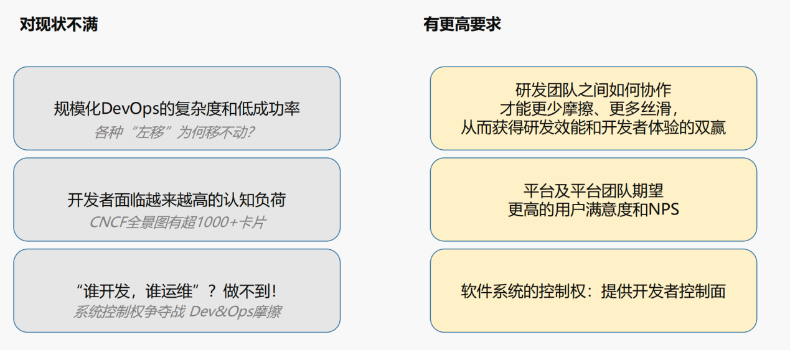
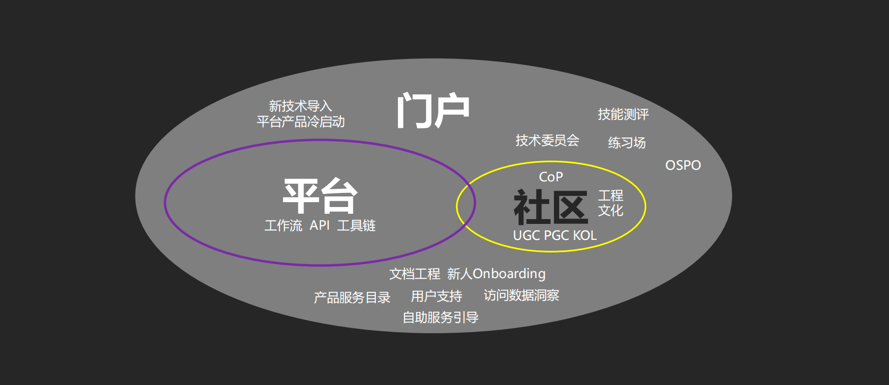

# vivo 企业内部的开发者关系实践
> 近两年，现代应用程序开发的速度越来越快，复杂性越来越高，企业内部的业务部门和研发团队也越来越期待在技术交付和可扩展性，以及开发体验之间找到最佳平衡。在这一背景下，与企业内部开发者息息相关的平台工程越来越受关注和热议，甚至连续两年入选 Gartner 年度 10 大技术趋势。尽管当前中国的平台工程处于技术萌芽期，但从 DevOps 到 IDP，当我们回头去梳理平台工程相关技术的发展时发现，开发者体验是一个不可忽视的关键因素，它对于构建成功的平台起到了重要的作用。在本案例中，我们将从平台工程出发，分享 vivo 在平台工程探索过程中的一些关键实践与创新成果，希望通过 vivo 对平台工程和开发者体验的思考，能够为更多企业和组织推动未来年度的战略更新和技术规划提供价值参考。

# 1 平台工程与内部开发者关系

⠀在讨论内部开发者关系之前，我们首先要明确平台工程的概念。参考CNCF、Gartner等对于平台工程的定义，当前具有一定行业共识度的是说法是：平台工程是一门设计、构建、维护和改进软件开发工具链和工作流程的学科，可在云原生时代通过全面一致的工具和流程为软件工程组织提供自助服务功能。
你会发现，平台工程始终围绕着开发者及开发者团队展开，最终讨论的是人和团队本身及其之间的协作模式。值得注意的是，vivo 在倡导和实践平台工程过程中，结合了组织内部工程文化而非工程师文化的建设，强调角色与职责而非与个体绑定。这与流行于全球的工程文化理念一脉相承，也更便于在组织内部推行。
vivo 对内部开发者关系的探索正是通过平台工程践行的，旨在通过加强平台文化与工程文化建设，提高平台团队与业务团队之间的沟通和协作效率，减少因各自所在业务单元视角不同产生的摩擦，进而提升开发者体验，并保证优质生产力的可持续。

# 2 vivo 的平台工程建设背景

⠀vivo 互联网业务始于 2011 年，经历了体系化的技术建设，从各个团队单体烟囱到服务化，再到平台化，如今已形成了自己的一套平台生态体系。
### 2.1 平台工程的推动者：vivo 互联网的基础平台团队
推动这一系列体系化技术建设的，是 vivo 互联网的基础平台团队。该团队由各平台技术方向的研发人员和平台产品经理组成，其中绝大部分都是研发，他们共同为所有业务线提供从底层的基础设施，到上层的中间件和各业务线定制的平台服务，自下而上地支撑业务发展。
### 2.2 vivo 平台工程的建设本质：为了更好地服务业务发展
无论是 DevOps 还是 IDP，软件工程领域过去二十年都遵循了一个趋势，那就是在产品既要保证客户预期质量，又要快速推向市场的背景下，企业和组织越来越依赖于标准化的工具、组件和自动化的流程。
在这个趋势下，平台工程建设的动因主要包括以下两方面：
**一方面对现状的不满。**一是，当 DevOps 实践需要支持并满足多团队需求时，扩展性就会受到影响。二是，在云原生技术的加速下，工具环境的数量和复杂性快速增长，开发者需要对交付过程中越来越多的部分负责，无形中增加了认知负荷。三是，“谁创建，谁拥有”的理念使得开发人员无法拥有完整的软件系统控制权，带来可用性、安全和合规等风险。
**另一方面是对未来的更高预期。**一是，期望研发团队之间的协作能更少摩擦、更加丝滑，从而获得研发效能和开发者体验的双赢。二是，平台及平台团队期望获得更高的用户满意度和 NPS。三是，期望开发人员拥有完整的软件生命周期，获得软件系统的控制权。

与此同时，vivo 互联网业务规模快速增长，基础设施日趋复杂，应用架构越发多样。就 vivo 自身发展而言，在微观层面，vivo 平台团队的职能定位是支撑业务发展，这就要求平台团队必须与业务团队保持紧密配合。
在宏观层面，平台化的架构演进是业务发展到一定规模必然要面对的选择，其核心就是将某一领域问题从业务软件中解耦出来内聚为一个独立平台集中管控，并不断演化出标准与边界都逐渐清晰的平台生态，一站式地解决一类问题，在组织内部实现高效的复用，支撑业务快速迭代。

# 3 vivo 的平台工程创新实践与内部开发者关系探索

⠀在对内部开发者关系的探索中，vivo 平台团队关注的核心是开发者体验，包括使用平台的内部开发者对平台的满意度、期望值与现状之间的差距有多大，使用平台对其业务带来新的潜在增长的可能性等等。对 vivo 而言，开发者体验是平台工程的基石，是最大化提升开发效率的关键。
### 1 重塑开发者体验

⠀在关注开发者体验的大前提下，vivo 在尝试落地平台工程时主要有三个方向：
**第一，平台本身能力要过硬，这是开展内部开发者关系工作的前提。**与业内相比，内部技术平台本身从功能、体验到非功能性指标和底层能力在哪里，可能就代表了其对业务支撑非常重要的天花板在哪里。因此，平台本身一定要紧跟业务诉求和行业发展趋势，持续不断地提升平台自身能力，有一些平台的能力甚至需要走在业务发展的前面。对平台自身能力的重视和前瞻性的规划，本质上是提供了兼具技术支撑和用户支持的平台思路，能够更好地推动技术规划的有效性，使其更贴近业务。
**第二，借鉴外部开发者关系实践，通过用户分层沟通提升协作效率。**建立用户群组，匹配专人支持，这种高频有碎片化的服务形式往往容易把用户放在对立面。vivo 将外部开发者关系的实践借鉴到内部开发者关系中，尝试把群组打造成一个可供用户交流的、与平台封装技术相关的实践社区（CoP）。不同能力阶段的用户都可以很容易地在社区中找到需要的文档、知识库，获得群组咨询、用户互助、工单支持，还可以参与平台的共建，能看到自己提供的建议和意见，在帮助平台往更好的方向迭代和优化。通过用户分层沟通，引导不同用户参与，有效减少了沟通摩擦，提升了协作效率，用户也会更愿意站在技术的角度关注通过平台能力为业务实现了什么功能，带来了怎样的增长可能。
第三，**向更加面向用户的内部开发者门户演进，提供更好的用户预期和体验。**门户更加面向用户，不是简单的 PaaS 层的服务罗列或者分组。在整个门户上，用户能够看到整个企业有哪些技术的平台产品可以使用，还能够看到这些平台产品组合使用的成功案例，以及其他用户对这些平台产品的讨论、沉淀下来的知识和经验，甚至了解到一些技术洞察项目的技术规划，获得更好的体验和预期。
### 3.2 平台即产品 PaaP
在 vivo 看来，**平台团队提供的平台本质上是一款产品。**你期望收获更高的用户满意度，就应该跟你的用户之间建立更好的沟通协作关系。因此，**vivo 借鉴了公司对外部开发者关系的逻辑和沟通方式来做内部开发者关系**，包括最典型的怎么让用户参与、怎么衡量用户对产品的满意度，怎么做好用户的日常沟通等。
以传统的“工单运维”为例。传统的“工单运维”往往跟着人与角色走。对大中型企业而言，一个平台可能有数千名用户在使用。如果基于工单与用户进行常态化沟通，团队的价值确实可以用处理工单的数量、速度、解决问题的比例等指标去度量，但如果追求更加高效的协作沟通效率和用户满意度，则需要更进一步。
一个好的平台应该像产品一样充分考虑用户旅程，具有完善的文档与上手指引，完整的使用流程和体验，用户在遇到大部分问题时都能够通过查询知识库、阅读文档等方式自助式解决，剩下 5% 甚至更少的问题才需要通过工单解决。这与平台工程实践中关注的开发体验与自服务理念一致，也是工程文化的一种体现。
对平台团队而言，平台的价值不只是满足用户和业务团队基本的功能性的诉求，更重要的是能够在组织内跨业务线地降低成本，提升效率。从这个角度来讲，在内部践行开发者关系，和用户之间有更好的沟通，跟业务团队一起推动平台向前演进，技术创新价值会离业务更近，技术沟通的氛围也会更好。

### 3.3 内部开发者门户与社区驱动的平台工程：码力社区
**3.3.1 码力社区的建设背景**
码力社区是 vivo 内部开发者门户的重要组成部分。在码力社区之前，vivo 其实是拥有内部知识管理平台的。与公共知识管理平台不同，**企业级知识管理平台的一个重要特质就是基于角色权限的访问控制。**以 vivo 的智能手机业务为例，手机在研发过程中是有严格的保密等级的，在项目协作中的支持就需要有对应权限，以保证所有访问都是经过授权的。因此在研发团队中，就技术话题本身进行沟通的时候，传统知识管理平台很难满足他们的需求。
经过 vivo 平台团队访谈和沟通发现，**用户真正想要的是像使用开源软件一样使用内部平台。**即使国内外这类社区产品非常多，但企业级场景中真正要和内部已有的系统集成较好，依然需要重头去做一些工作。于是 vivo 决定基于我们对平台工程的探索，沿着开发者门户与开发者体验的思路，将内部开发者社区作为最后一块“拼图”加速补上。
**3.3.2 码力社区的构建和运营挑战**
平台部门参考行业最佳实践和平台工程最新理念，最后将码力社区定位为内部的开发者社区。vivo 基于深刻的内部开发者洞察打造了码力社区，横向拉通了各业务单元，能够更好地将平台的提供方和平台的使用方放在一个场域中去交流技术。尽管构建社区的技术本身并没有难度，但以内部开源项目的形式推进社区建设 vivo 也遇到了挑战。
**第一，内部开源产品比外部开源产品的可控性更差。**大部分外部开源贡献者关注参与的项目与其本职工作高度相关，但内部开源项目的贡献者其本职工作与项目本身并不相关，大多是基于兴趣和其他个人目的。如果业务压力较大时可能会影响他参与项目的稳定性和持续性。需要注意的是，对三五百人的公司来说，技术上能参与项目的潜在开发者可能只有二三十个甚至更少，如果群体规模太小，以内部开源产品去推进社区建设的难度就会很大。
**第二，内部社区运营要保持对用户的吸引力难度更高。**以社区用户激励体系为例。vivo 首先研究了业内不少优秀社区产品的激励体系及其实现策略算法，但直接拿到内部落地的时候仍然存在问题。比如在积分兑换社区周边的场景，一般来说社区周边对公司内部的吸引力较弱，而面向内部的开发者社区要如何确保周边对内部人员的吸引力，以激励用户持续贡献社区是运营人员需要不断思考的。就实践经验来看，勋章体系效果相对较好，甚至可在某些场景为用户创造惊喜。
**第三，相比外部社区，内部社区很难额外获取运营预算等资源支持。**vivo 的企业文化倡导很强的用户导向思维，不鼓励使用粗暴的硬性通知推广产品。这时候社区可以策划组织技术赛事等社区活动在内部帮助业务团队推广产品，牵引业务部门与目标用户建立更多接触点，提供支持和交流。

**3.3.3 码力社区的建设现状和亮点**
整体来看，码力社区还在持续建设的过程中，离成熟大约还需要1-2年的时间周期，但目前**码力社区承担的职责比最初设想的要更加广泛。**社区中除了设有博客专栏、问答等基础模块，还设有活动模块和技术展架。活动包括了组织内外部的活动，大家发现好的外部技术会议也可以在这个模块中创建内容进行推荐，用户可以进行报名、记录，并发布会后分享与评价。平台团队还将一些研发团队各自在项目中沉淀下来的公共工具和公共能力收入了技术展架，供所有内部开发者用户学习和使用。目前，除了日常开发所用到的产研平台之外，内部的所有流量基本都汇聚在了码力社区之中。
此外，社区还承担了部分开源治理的职责。内外部开源相关需要透明化的信息也会通过社区呈现给内部开发者。
**码力社区整体更加开放。**一方面，码力社区的技术讨论氛围比之前的用户群组更加开放。虽然是聚焦互联网业务，但是在整个 vivo 内部是对所有人开放的，哪怕不是互联网业务的也可以使用，无论是做安全的，还是影像的，又或者是做 AI 的、OS的，只要有需求都可以在平台上很开放地去讨论技术话题；比如前段时间 vivo 基于 Rust 开发的 BlueOS 蓝河操作系统，就引起了社区内对于 Rust的 讨论，并由此建立了 Rust SIG（特别兴趣小组）。
另一方面，码力社区从一开始所用的架构和技术栈就是完全开放的。这意味着，在下一个阶段，公司内的任何一个工程师只要有能力，就能参与社区的建设。目前码力社区完全由内部工程师打造和运营，以内部开源项目的形式推进建设，有效提升了用户的参与程度。同时，码力社区参考了 CoP 实践社区的理念，通过 SIG 牵引建立了技术兴趣圈子，形成了良好的社区技术氛围，并为开发者提供了发挥和展现技术能力的舞台。
# 4 成功的平台工程实践特质

⠀在业务和团队有一定规模化程度的企业或组织中，内部开发者门户封装的大多都是面向内部开发者的平台类产品，为了让平台的使用方和提供方之间更好地沟通协作，需要借助内部社区，形成一个围绕平台、门户、社区的相对成熟的内部产研体系。

vivo 认为基于对平台工程的探索而推动形成一个高效的内部产研体系，应该具备以下特质：
**首先，重视内部开发者体验。**组织关注的研发效能，往往是希望用更少的人，在最短的时间内，完成更多符合质量要求的软件交付，这看起来是最完美的研发效能提升。事实上，如果组织通过流程定义非常复杂规则，要求开发人员按照规则行事，组织的效率在当下可能是最高的，但是开发人员的满意度就会大打折扣。最后会反应在员工的敬业度和满意度上，导致优秀人才流失，长此以往会导致整个团队的能力下降，无法做到健康长久。因此需要明确研发效能与开发者体验两方面的关键度量指标，并持续提升它。
**其次，核心依然是平台本身。**从 DevOps、SRE 到平台工程，越来越多新的理念能够让平台团队更好地做平台，做出的平台也能更好地满足业务的诉求，与业务团队更好地互动。在外部环境快速变化的当下，如果平台自身不主动求变，在 1-2 年后，相当多的关键指标就会显著下滑，因此平台团队是否愿意尝试和不断迭代做平台的思路、方法和理念是很重要的特质。另外，内部的多个平台之间的关系通常从一开始的并行演化到最终的网状关系，这要求多个平台之间的动态高效协同，才能最终为业务团队提供一致的体验。
此外，通过横向对比第三方解决方案，可以间接来判断平台成熟度，也是平台成功的重要参考指标。

# 5 vivo 平台工程的未来规划

⠀vivo 基于开源软件生态为全球 5亿+智能手机用户提供极致体验和智慧服务。从整体思路上说，vivo 从基于开源生态技术栈发展业务，进而开展智能手机、互联网等业务；到重视开源治理，包括确保所有使用的开源技术的合规性、安全性和整个开源软件供应链的健康度；下一阶段，将更加关注开源技术的使用效率，给业务带来的价值，包括对重点使用的开源项目将新增特性向上游提交，以及探索未来针对技术投入产出比和技术规划有效性的动态策略。
更加细化来说，在整个云原生技术持续往前快速发展的时候，vivo 非常关注同行共识在所有技术的新方法、新理念、新工具方面的动态，并适时在内部采纳，给业务带来新的价值点。前面提到的码力社区、内部的开发者平台与门户等都是从平台工程借鉴的非常重要的实践经验。
在组织层面，最近两年 vivo 平台产品经理的岗位角色比以前要显著增加，这也体现了 vivo 更愿意把整个平台像产品一样去做的理念和决心。
对于码力社区，vivo 希望能够继续在内部全面开放，经过 2-3 年持续的内部需求消化，迭代成熟后未来考虑推向外部，借助其封装的基础功能以及内部开发者关系、开发者体验、平台工程等理念，与同行分享 vivo 的实践经验，更好地推动开源软件生态的可持续发展。
